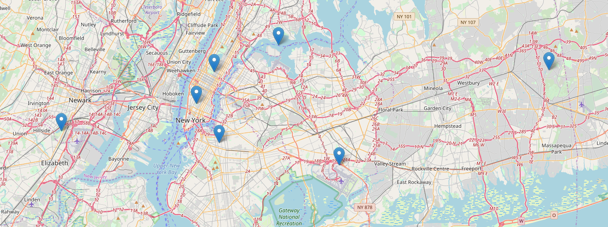
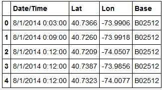
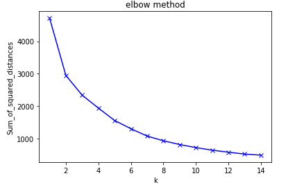
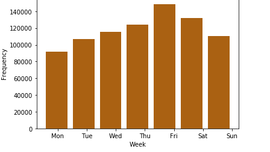
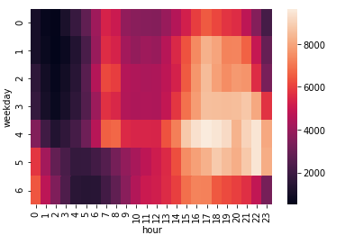

# Analysis of Uber trips

### Project Description:
In this project I have analyzed the Uber Pickups in New York City. The dataset is obtained from the kaggle.New York City has five boroughs: Brooklyn, Queens, Manhattan, Bronx, and Staten Island. I have applied K means clustering algorithm to understand the trips taken on uber in the New York City.

### Software and Libraries:

    1.pandas
    2.matplotlib
    3.folium 
    4.seaborn
    5.sklearn
    6.Python 3
    
### Dataset
There are total 829,275 observations and four columns.The dataset contains data from April to September 2014.The analysis is done on the August 2014 dataset.
Dataset : [Uber Pickups in New York City](https://www.kaggle.com/fivethirtyeight/uber-pickups-in-new-york-city)

### Images

 

• The above chart shows the all seven centroids have been plotted on the map.Now these centroids can be really helpful by acting as a hub so whenever a uber recives a request for ride it can check the minimum distance to each of these centroids. 

 

The dataset is large so only few values are printed. Mainly there are 4 columns and are described as below:

    • Date/Time : The date and time of the Uber pickup
    • Lat : The latitude of the Uber pickup
    • Lon : The longitude of the Uber pickup
    • Base : The TLC base company code affiliated with the Uber pickup

 

• In the above chart Elbow method is used to find the optimal value of k by fitting the model with a range of values for K.

 
• Analyzing the data by weekday and Frequency. 

 
• Analyzing hour and day together using seaborn chart.      

### Key Points
• If we observe the chart properly then we can see that as the sum of squared distance decreases with the number of clusters  increases. After k=6 there is significant reduction. so we can choose 6 or 7 as as the cluster.
• Predicting new location such as (40.7332,-74.2342) then it is centroid for cluster 2. 
So the new latitude and longitude value 40.7332,-74.2342 should be assigned to the cluster 2 . This will be as distance from the centroid of cluster 2 is minimum. So the uber ride will come closer to cluster 2.

    
## References

    Wikipedia
    Datacamp
    A lot of googling to figure out how to do stuff.    

